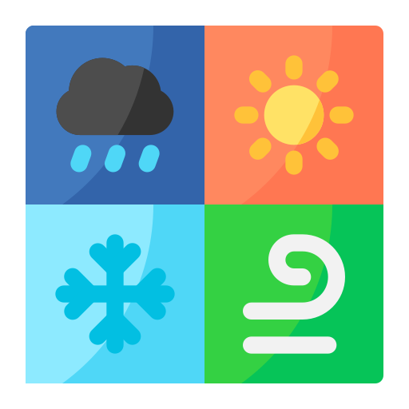
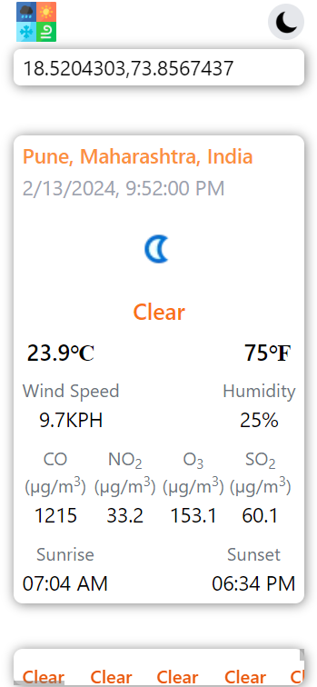

<h1>  Weather WebApp </h1>

<h2>Technologies used</h2>

  
  
  
  
  

<h3>Live Site URL</h3>
[Globe Climate: https://globeclimate.netlify.app/](https://globeclimate.netlify.app/).

### Features
1. App is made using third-party API  [Weather API](https://www.weatherapi.com/).

2. Allowing **Location Permission** will help to find **Current Location Weather Conditions**.
</img>

3. Search using **"city name"** or **"latitude,longitude"** in search barfor getting **desired location weather conditions**.
 
*City name Exapmle :*
 
</img>
 
*Latitude,Longitude Exapmle :*
 
</img>

4. Search bar provides **Suggestion Feature**, which will help in **Faster Search**.
  
</img>

5. Switching **Dark Mode** will provide better **UI Experience**.
 
</img>

6. WebApp is also responsive.
 
*Mobile Devices :*
 
</img>
 
*Tablets :*
 
</img>
 
*Desktop :*
 
</img>